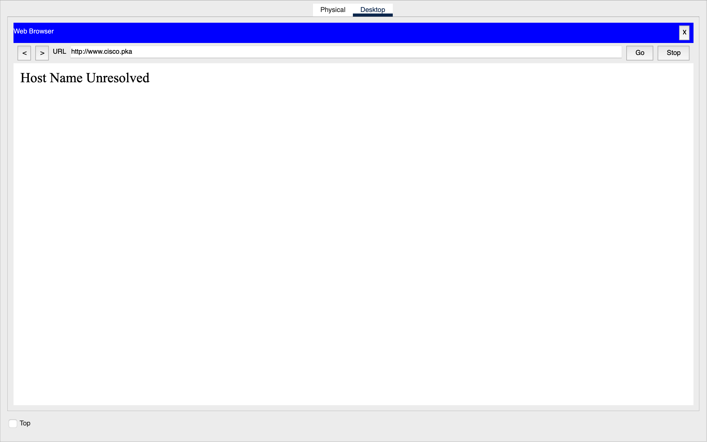
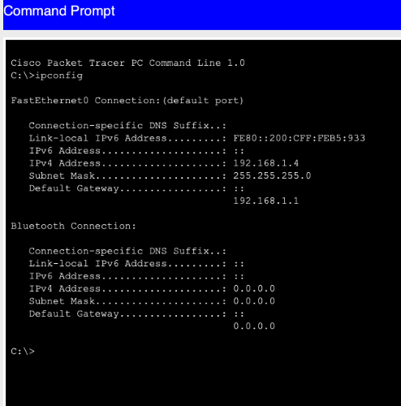
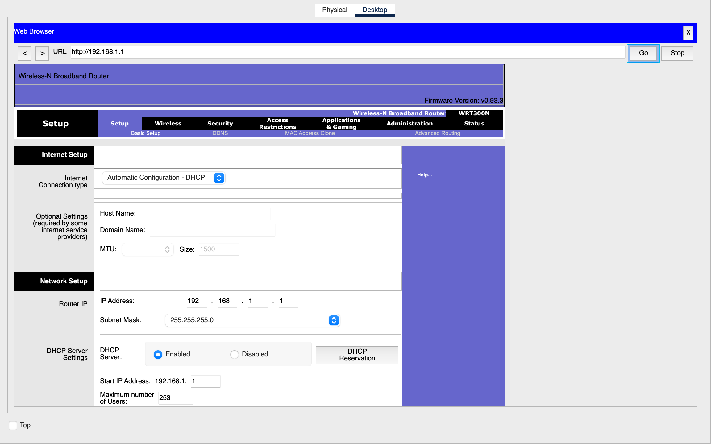
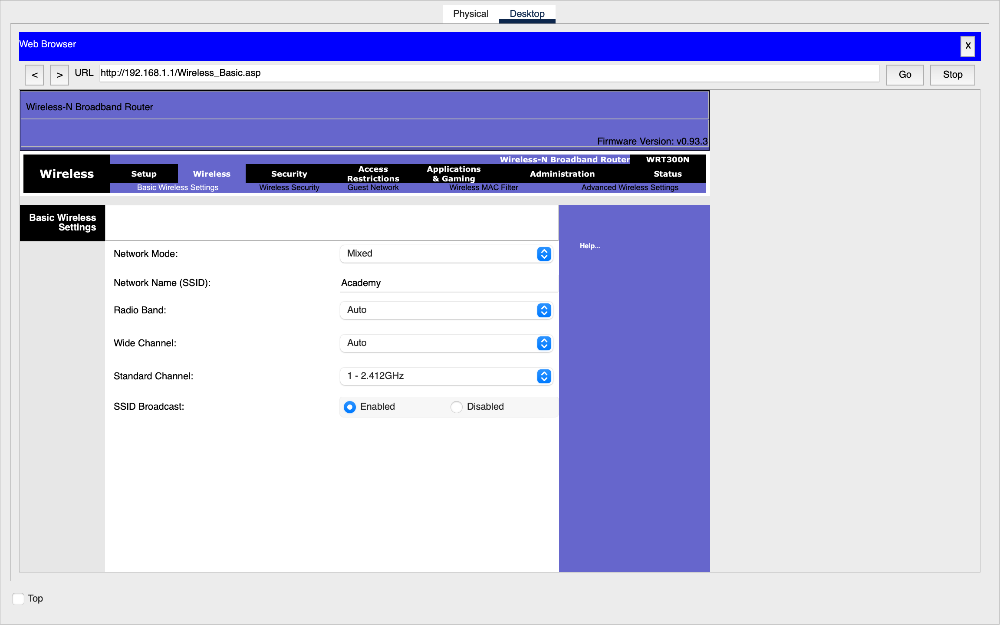

# Packet Tracer Lab: Troubleshoot a Wireless Connection
## Table of Contents
- [Overview](#overview)
- [Methodology & Steps](#methodology--steps)
  - [1. Problem Identification](#1-problem-identification)
  - [2. Discovering Router IP](#2-discovering-the-router-ip-address)
  - [3. Accessing Router Configuration](#3-accessing-the-routers-configuration)
  - [4. Investigating Wireless Settings](#4-investigating-wireless-settings)
  - [5. Implementing Solution](#5-implementing-the-solution)
- [Key Learnings](#key-learnings)
- [Tools Used](#tools-used)
- [Repository Structure](#repository-structure)
- [Skills Demonstrated](#skills-demonstrated)
**Objective:** Diagnose and resolve a wireless connectivity issue for a client (Laptop1) in a simulated network.

## Overview
This activity involved methodically troubleshooting why Laptop1 could not access the network or the internet while other devices could. The process required using diagnostic tools, accessing router configuration, and applying the correct wireless security settings.

## Methodology & Steps

### 1. Problem Identification
*   Opened the web browser on all devices and attempted to navigate to `http://www.cisco.pka`.
*   **Result:** Only Laptop1 returned a "**Host Name Unresolved**" error, confirming it was the isolated problem device.
    

### 2. Discovering the Router's IP Address
*   On a working PC (PC3), opened the **Command Prompt** and executed the `ipconfig` command.
*   **Key Finding:** The **Default Gateway** was `192.168.1.1`. This is the IP address of the Wireless Router.
    

### 3. Accessing the Router's Configuration
*   From a connected PC, opened a web browser and navigated to the router's IP: `http://192.168.1.1`.
*   Verified the router's basic setup, including its LAN IP and that the DHCP server was enabled.
    

### 4. Investigating Wireless Settings
*   Navigated to the **Wireless Basic Settings** page (`http://192.168.1.1/Wireless_Basic.asp`).
*   **Noted the SSID:** `Academy`. However, connectivity requires more than just the SSID.
    

### 5. Implementing the Solution
*   On Laptop1, attempted to connect to the "Academy" wireless network.
*   A prompt appeared requiring a **WPA2-Personal** passphrase.
*   **Entered the Pre-shared Key:** `Cisco123`.
    
*   After connection, Laptop1 successfully accessed the test website, confirming the issue was resolved.

## Key Learnings

### Troubleshooting Methodology
The activity reinforced a systematic approach to network troubleshooting. Starting with problem isolation was crucial—by testing connectivity on multiple devices, it was clear that only Laptop1 had issues, pointing to a client-specific problem rather than a network-wide outage.

### Diagnostic Tools
Using `ipconfig` on a functioning device revealed the router's IP address through the default gateway field. This highlighted the importance of knowing basic command-line tools for network diagnostics. While `ping` tests basic connectivity, `tracert` provides more detailed path information by showing each hop between source and destination.

### Wireless Security Configuration
The exercise demonstrated that wireless connectivity requires both the correct SSID and matching security credentials. WPA2-Personal with a pre-shared key is a common security method for home and small office networks. The experience also emphasized why changing default router passwords is critical for network security.

### Practical Application
Hands-on practice with simulated network equipment builds confidence in real-world troubleshooting scenarios. The step-by-step process of identifying the problem, gathering information through diagnostics, accessing device configurations, and implementing the solution provides a reliable framework for addressing similar issues in production environments.

## Tools Used
*   Cisco Packet Tracer
*   Command Line (`ipconfig`)
*   Web Browser
*   Wireless Router GUI (simulated)

---

## Repository Structure
